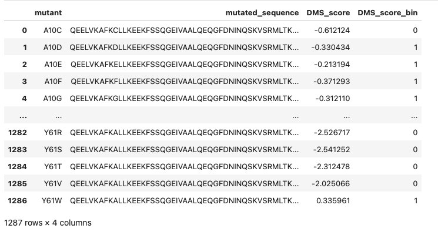
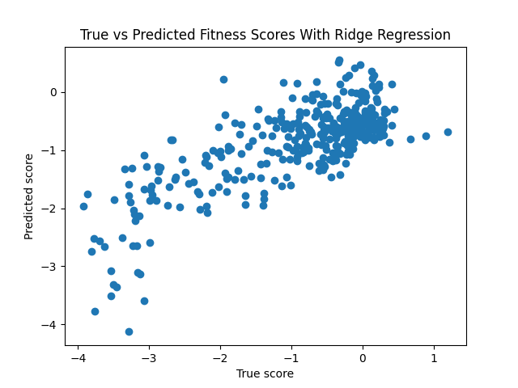
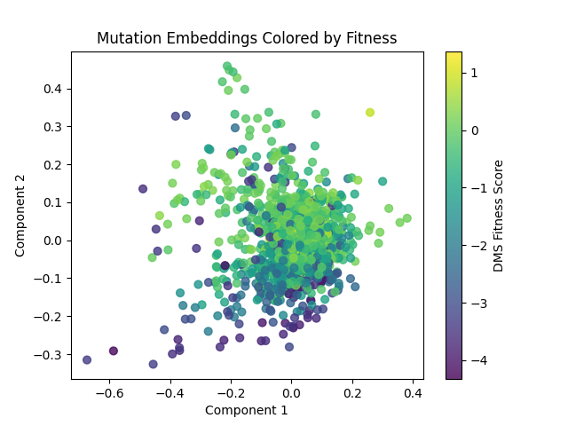
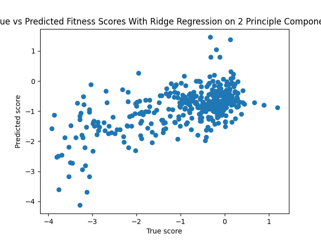
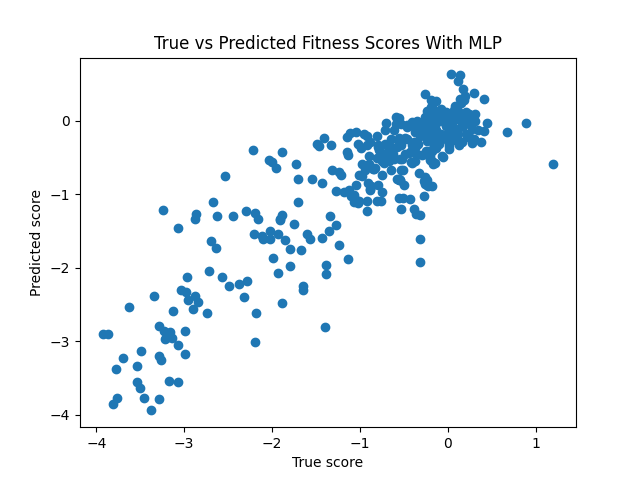
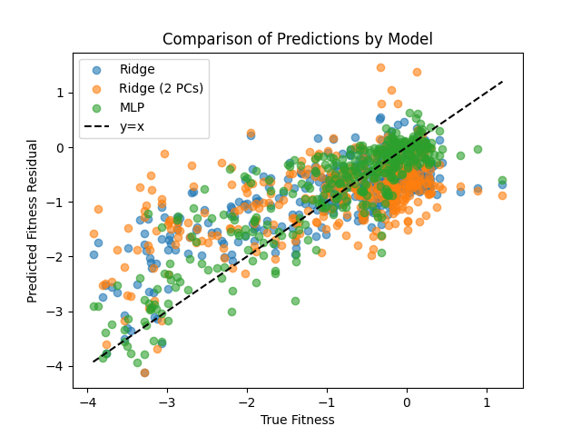
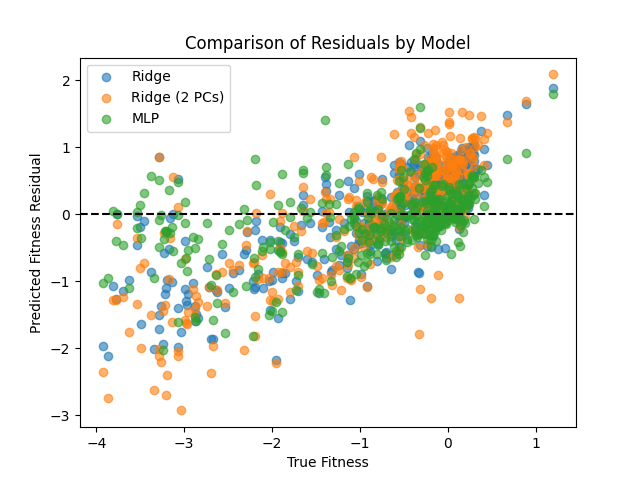

# Protein Language Model Embeddings for Mutation Fitness Score Prediction
## Overview
The goal of this project is to create a minimal setup to evaluate whether embeddings from protein language models (ESM) encode information relevant to fitness of mutations. 
To keep the setup minimal, we choose a single mutation type (missense mutations) and a single protein (ARGR_ECOLI) for these experiments. This allows us to draw conclusions without potentially confounding information that would be introduced by a large dataset. This can be thought of as a viability or groundwork study to determine if this task is suitable for larger-scale ML modeling with deep learning.

**Dataset:** DMS dataset of E.Coli protein mutations (1287 missense mutations for ARGR_ECOLI)

**Key questions:**

1. Is there a linear relationship between ESM embeddings and mutation fitness
2. Is there meaningful structure in embedding geometry as it relates to fitness?
3. Does the mapping from embedding -> phenotype include non-linear interactions between embedding dimensions?

## Data Loading and Preprocessing:
* A single protein was selected from ProteinGym (ARGR_ECOLI)
* Data consists of mutant description, mutated sequence, fitness score, and a classification as either benign or pathogenic. Mutant description is in the format ‘A10C’ = A is replaced by C at index 10 (1-indexed). See Figure 1.
* Sequences are tokenized, and ESM2 embeddings are computed with ESM model ‘facebook/esm2_t6_8M_UR50D' from HuggingFace. This version is chosen due to the small dataset size and minimal compute requirements.
* Each sequence is tokenized into a 71-character string, and embeddings are computed per input token, resulting in an output dimension of (num_mutations, num_tokens, emb_dim). We take the mean along the token dimension for the remainder of this analysis, resulting in embeddings with shape (num_embeddings, emb_dim) which in this case is (1287, 320).
* For these experiments, the delta between mutation and wild type, computed as  **(mutation_embedding - wild_type_embedding)** is used.
* A train-test split is computed with a test set size of 30%
* For these experiments, off-the-shelf preprocessing functions and models from scikit-learn are used

Figure 1. Raw Data

## Experiments
As mentioned in the Overview, there are 3 key questions that are investigated here.

### Question 1. Is there a linear relationship between ESM embeddings and mutation fitness

**Experiment:** We run a Ridge Regression (linear regression with L2 regularization) and evaluate with Spearman and Pearson correlation coefficients.

**Results:**
| Spearman | Pearson |
|----------|---------|
| 0.63     | 0.76    |

Figure 2.

**Takeaway:** Strong Spearman and Pearson indicate that embeddings do in fact linearly encode phenotype information.
  

### Question 2. Is there meaningful structure in embedding geometry as it relates to fitness?

**Experiment:** Extract principal components (PCA) and analyze the relationship of the first two components to fitness score. The gradient visible in Figure 3, suggests that there is some alignment with the Y axis (corresponding to the second principal component). 

Figure 3. 

Given this observation, we run Ridge regression with just the first 4 principal components (computing 8 components in total), but find performance is worse.

**Results:**

| Spearman | Pearson |
|----------|---------|
| 0.48     | 0.59    |

Figure 4.

**Takeaways:** The signal from the embeddings is high-dimensional. PCA identifies directions with greatest variance, but despite the appearance of correlation of the first components with mutation fitness, restricting the signal to only these components proved detrimental to fitness prediction ability.

### Question 3. Does the mapping from embedding -> phenotype include non-linear interactions between embedding dimensions?

**Experiment:** Construct a small MLP (2 hidden layers with dim 16, batch size 8, lr=1e-4). Note that it needs to be small, and trained with early stopping due to the small dataset size. Also note that due to the small dataset size, we can draw conclusions only qualitatively, about overall non-linearity of the problem, rather than claiming quantitative results (the model overfits, as can be observed from comparing train vs test set metrics).

**Results:**

| Train/test    | Spearman | Pearson |
|---------------|----------|---------|
| Train         | 0.83     | 0.89    |
| Test          | 0.88     | 0.95    |

Figure 5.

**Takeaway:** The improvement over Ridge Regression suggests that there are indeed non-linear relationships between embedding dimensions relevant to mutation fitness.

### Summary & Conclusions
In a narrow, minimal problem setting (one protein, missense mutations), we have shown that ESM2 embeddings contain useful signal for predicting mutation fitness. There is a linear relationship, but the results suggest that predictive performance can be further improved by exploring non-linear relationships between embedding dimensions. Given these results, it would be reasonable to now try to expand the problem setting to multiple proteins and larger, more complex models.

Below, we compare the 3 models explored in this study in a single overlay. Figure 7 shows a comparison of the predicted fitness scores across 3 models, while Figure 8 shows the score residuals. Figure 6 includes a table comparing Spearman and Pearson correlations across the 3 approaches.

Figure 6. Comparison of metrics across models
| Model         | Spearman | Pearson |
|---------------|----------|---------|
| Ridge         | 0.63     | 0.76    |
| Ridge (2 PCs) | 0.48     | 0.59    |
| MLP           | 0.82     | 0.89    |

Figure 7.

Figure 8.

